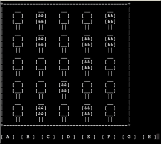

# Light Box

A light-box game in Python & Curses modeled after the OSRS clue scroll minigame

## Python Version
```
3.6.5
```

## How to play

Run `python light_box.py`, then use the A, B, C, D, E, F, G, H keys to toggle the lights until all of them are on.


